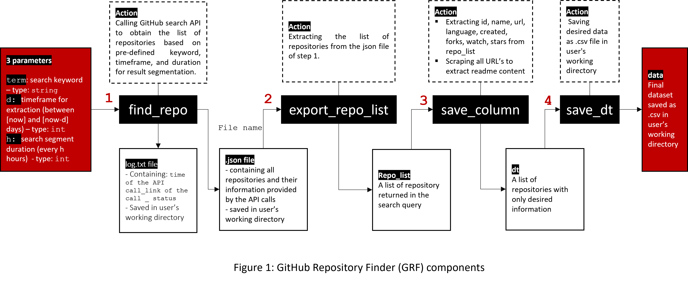

# Github Repository Finder - with sample dataset

## Introduction
This notebook gives information about the function used to fetch Github repositories based on a keyword and a determined timeframe starting from the day of fetching.

## Running instruction

### Requirements:
1. Generate your own Github Token: [Creating a personal access token](https://docs.github.com/en/authentication/keeping-your-account-and-data-secure/creating-a-personal-access-token)
2. Save your token as an enviroment variable, remember to name the variable as 'GITHUBTOKEN': [Configuring Environment Variables](https://tilburgsciencehub.com/building-blocks/store-and-document-your-data/store-data/environment-variables/) 
3. Make sure you have installed the following packages in python: requests, math, datetime, dateutil, csv, pandas, json, os, time. Installation instruction can be found at [Python website](https://www.python.org/) 

## Function structure:
GRF collects data by operating 4 separate steps accquired via 4 functions: find_repo, export_repo_list; save_column; save_dt. The working of these functions is illustrated in the following diagram:




## Sample dataset:
A sample dataset was obtained by using the following command:
```
grf("python", 3, 8)
```
+ Detailed datasheet can be found here: [Datasheet for GRF sample dataset](docs/Datasheet_for_GitHub_Repository_Finder_Sample_Dataset.pdf)
+ Below is a preview of the final dataset:


```python
import pandas as pd
pd.read_csv("data/dt.csv", delimiter= ";",nrows=10)
```


<div>
<style scoped>
    .dataframe tbody tr th:only-of-type {
        vertical-align: middle;
    }

    .dataframe tbody tr th {
        vertical-align: top;
    }

    .dataframe thead th {
        text-align: right;
    }
</style>
<table border="1" class="dataframe">
  <thead>
    <tr style="text-align: right;">
      <th></th>
      <th>id</th>
      <th>name</th>
      <th>url</th>
      <th>language</th>
      <th>created</th>
      <th>stars</th>
      <th>watch</th>
      <th>forks</th>
      <th>readme</th>
    </tr>
  </thead>
  <tbody>
    <tr>
      <th>0</th>
      <td>416977797</td>
      <td>AI_Project</td>
      <td>https://github.com/pbl4team/AI_Project</td>
      <td>Python</td>
      <td>2021-10-14T03:37:01Z</td>
      <td>0</td>
      <td>0</td>
      <td>4</td>
      <td>Project AI Systeam - Computer Vision with pyth...</td>
    </tr>
    <tr>
      <th>1</th>
      <td>416995331</td>
      <td>python</td>
      <td>https://github.com/Cam0411/python</td>
      <td>Python</td>
      <td>2021-10-14T05:06:00Z</td>
      <td>0</td>
      <td>0</td>
      <td>0</td>
      <td>python</td>
    </tr>
    <tr>
      <th>2</th>
      <td>416908634</td>
      <td>Python</td>
      <td>https://github.com/psplendid61/Python</td>
      <td>NaN</td>
      <td>2021-10-13T21:53:43Z</td>
      <td>0</td>
      <td>0</td>
      <td>0</td>
      <td>NaN</td>
    </tr>
    <tr>
      <th>3</th>
      <td>416963376</td>
      <td>python</td>
      <td>https://github.com/iAMSe/python</td>
      <td>NaN</td>
      <td>2021-10-14T02:28:55Z</td>
      <td>0</td>
      <td>0</td>
      <td>0</td>
      <td>python</td>
    </tr>
    <tr>
      <th>4</th>
      <td>416996896</td>
      <td>python</td>
      <td>https://github.com/rakeshk67/python</td>
      <td>NaN</td>
      <td>2021-10-14T05:13:42Z</td>
      <td>0</td>
      <td>0</td>
      <td>0</td>
      <td>python</td>
    </tr>
    <tr>
      <th>5</th>
      <td>416961346</td>
      <td>python</td>
      <td>https://github.com/colddie/python</td>
      <td>NaN</td>
      <td>2021-10-14T02:19:55Z</td>
      <td>0</td>
      <td>0</td>
      <td>0</td>
      <td>NaN</td>
    </tr>
    <tr>
      <th>6</th>
      <td>416990435</td>
      <td>Python</td>
      <td>https://github.com/mahdidahmani/Python</td>
      <td>Python</td>
      <td>2021-10-14T04:41:11Z</td>
      <td>0</td>
      <td>0</td>
      <td>0</td>
      <td>NaN</td>
    </tr>
    <tr>
      <th>7</th>
      <td>416952467</td>
      <td>python</td>
      <td>https://github.com/grace-th3/python</td>
      <td>Python</td>
      <td>2021-10-14T01:38:42Z</td>
      <td>0</td>
      <td>0</td>
      <td>0</td>
      <td>NaN</td>
    </tr>
    <tr>
      <th>8</th>
      <td>416928589</td>
      <td>Python</td>
      <td>https://github.com/Cheung-man/Python</td>
      <td>NaN</td>
      <td>2021-10-13T23:36:27Z</td>
      <td>0</td>
      <td>0</td>
      <td>0</td>
      <td>NaN</td>
    </tr>
    <tr>
      <th>9</th>
      <td>416935834</td>
      <td>python</td>
      <td>https://github.com/mygithuang/python</td>
      <td>NaN</td>
      <td>2021-10-14T00:15:25Z</td>
      <td>0</td>
      <td>0</td>
      <td>0</td>
      <td>python mygithuang</td>
    </tr>
  </tbody>
</table>
</div>


***

# Function source code:

## 1. Find_repo:
This is the main function that crawls repositories from GitHub based on the use of time and page parameters. The API queries are generated as illustrated in the following diagram:


After each page query, the call status is recorded into a log file. This log file is saved into user's working directory as log.txt.

The main result is saved into a single json file.


```python
#Step1: Searching for repositories, crawling data, storing responses in a .json file

def find_repo(term, d, h):
    '''
    First component of GRF function.
    Searches for repositories on GitHub, returns name of a .json file of original data.

            Parameters:
                    term (str): A string defining the search term
                    d (int): An integer defining the timeframe to search (in days)
                    h (int): An integer defining the duration (in hours) of each query

            Returns:
                    filename (str): Name of a single .json file which stores the original response data
                    .json file: A file of raw data stored in working directory
                    log.txt: Log file recording all API calls and their status
    
    Check GRF documenation for more details.
    Source code available at: https://github.com/thtbui/github-repository-finder 
    ''' 
    #importing required libraries
    import requests
    import math
    from datetime import datetime, timedelta
    from dateutil.relativedelta import relativedelta
    import csv
    import pandas as pd 
    import json
    import os
    import time
    
    #constructing URLs
    token=os.environ['GITHUBTOKEN']
    URL = f'https://api.github.com/search/repositories?q={term}+created:SINCE..UNTIL&per_page=100'
    HEADERS = {'Authorization':f'{token}'}
    
    #setting timeframe and search segments
    since = datetime.today() - relativedelta(days = d)  
    until = since + timedelta(hours = h)
    
    #setting name for the final json file
    fetch_time=f'{datetime.today()}'.replace(":","_")
    filename = f'{term}_{d}days_{fetch_time}.json' 
    
    # creating the log file to monitor error
    log_file = 'log.txt'
    f = open(log_file, 'w')
    f.close()
    
    # creating an empty json file to combine all json files returned from each call:
    f= open(filename,'w',encoding='utf-8')
    f.close()
        
    while until < datetime.today():
        day_url = URL.replace('SINCE', since.strftime('%Y-%m-%dT%H:%M:%SZ')).replace('UNTIL', until.strftime('%Y-%m-%dT%H:%M:%SZ'))
        search_response = requests.get(day_url, headers=HEADERS)
        time.sleep(7)
        
        #print out No of repos in every h-hour request
        print(f'No of repositories created between {since} and {until}:{search_response.json().get("total_count")}')
        
        #If no Total_count found, print out the failed link and additional information
        if search_response.json().get('total_count') == None:
            print(f'Failed request: {day_url}')
            
            #saving status in log file:
            f = open(log_file, 'a')
            f.write(str(since)+'\t'+page_url+'\t'+str(search_response.status_code)+'\n')
            f.close()
            
            print(search_response.text)
            print(search_response.headers) 
        
        #if extraction successful, do pagination:
        else:
            #calculating the total No. of pages
            no_page = math.ceil(search_response.json().get("total_count")/100) 
            
            #pagination: running a loop to retrieve each page
            for i in range(1, no_page + 1): 
                page_url = f'{day_url}&page={i}'
                page_response = requests.get(page_url, headers=HEADERS)
                time.sleep(7)
                
                #writing all requests in a single json file (filename):
                repo_request = page_response.json()
                converted_to_string = json.dumps(repo_request)
                f = open(filename,'a',encoding='utf-8')
                f.write(converted_to_string + '\n')
                f.close()
        
                #saving status in log file:
                f = open(log_file, 'a')
                f.write(str(since)+'\t'+page_url+'\t'+str(page_response.status_code)+'\n')
                f.close()
                
        #update dates for the next search - moving {since} and {until} up /h/ hours
        since = until 
        until += timedelta(hours = h)
       
    return filename
```

## 2. extract_repo_list:
This function reads the json file saved by find_repo and return a list of repositories.


```python
#Step 2:  Extracting the list of repositories from the json file

def extract_repo_list(filename):
    '''
    Second component of GRF function.
    Reads .json file of repository data, returns a list of repositories.

            Parameters:
                    filename (str): Name of the .json file obtained from find_repo()
                    
            Returns:
                    repo_list (list): List of all repositories found in the search queries 
                    
    Check GRF documenation for more details.
    Source code available at: https://github.com/thtbui/github-repository-finder
    ''' 
    import json 
    f=open(filename,'r',encoding='utf-8')
    content=f.readlines()
    repo_list = []

    for item in content:
        jsonobj=json.loads(item)
        repo_list.extend(jsonobj["items"])
    return repo_list
```

## 3. save_column:
This function does two tasks:
1. Extracting information that is available in the json file provided by GitHub API
2. Looping through all the URLs of repositories to scrape the readme content

It returns a list of relevant information (id, url, name, language, creation date, stars, forks, watch, readme)


```python
#Step 3: save_column: Extracting relevant information from the repository list

def save_column(repo_list):
    '''
    Third component of GRF function.
    Extracts relevant repository information, saves it in a list.

            Parameters:
                    repo_list (list): List obtained from extract_repo_list()
                    
            Returns:
                    dt (list): List of repositories with only desired information 
    
    Check GRF documenation for more details.
    Source code available at: https://github.com/thtbui/github-repository-finder
    ''' 
    dt =[]
    
    #extracting data directly from the list
    for repo in repo_list:
        id = repo.get("id")
        name =repo.get("name")
        url = repo.get("html_url")
        created = repo.get("created_at")
        stars = repo.get("stargazers_count")
        watch = repo.get("watchers_count")
        language = repo.get("language")
        forks = repo.get("forks_count")
        
        #scraping readme by going through each repository url
        import requests
        from bs4 import BeautifulSoup
        readme=requests.get(url)
        soup =BeautifulSoup(readme.text,"html.parser")
        readme=soup.find(class_="markdown-body entry-content container-lg")
        #if readme is empty, recording as blank (NaN)
        if readme == None:
            readme =("")
        else: 
            readme=soup.find(class_="markdown-body entry-content container-lg").get_text().replace('\n'," ")

        dt.append({"id": id,
                     "name": name,
                     "url": url,
                     "created": created,
                     "stars": stars,
                     "watch": watch,
                     "language": language,
                     "forks": forks,
                     "readme":readme})
    return dt
```

## 4. save_dt:
This function saves the data into csv file in user's working directory.


```python
#Step 4: Saving dataset in .csv file and displaying the dataset:

def save_dt(dt):
    '''
    Forth component of GRF function.
    Saves desired data in a .csv file, returns a preview of the final dataset.

            Parameters:
                    dt (list): List obtained from save_column()
                    
            Returns:
                    data.csv: Final dataset stored in working directory
    
    Check GRF documenation for more details.
    Source code available at: https://github.com/thtbui/github-repository-finder
    ''' 
    import csv
    import pandas as pd 

    with open("dt.csv", "w", encoding='utf-8', newline='') as csv_file:
        writer = csv.writer(csv_file, delimiter = ";")
        writer.writerow(["id", "name", "url", "language", "created", "stars", "watch", "forks", "readme"])

        for item in dt:
            writer.writerow([item['id'], item['name'], item['url'], item['language'], item['created'], item['stars'], item['watch'], item['forks'], item['readme']])

    data = pd.read_csv("dt.csv", delimiter= ";")
    return data

```

# Applying the functions: 

We can apply 4 functions separately as below:


```python
# Step1: Search for repositories
filename = find_repo("python",3,8)

# Step2: Extract repository lists
repo_list = extract_repo_list(filename)

# Step3: Saving relevant information
dt = save_column(repo_list)

# Step4: Saving the dataset
data = save_dt(dt)
```

    No of repositories created between 2021-10-13 21:44:12.482296 and 2021-10-14 05:44:12.482296:452
    No of repositories created between 2021-10-14 05:44:12.482296 and 2021-10-14 13:44:12.482296:614
    No of repositories created between 2021-10-14 13:44:12.482296 and 2021-10-14 21:44:12.482296:765
    No of repositories created between 2021-10-14 21:44:12.482296 and 2021-10-15 05:44:12.482296:403
    No of repositories created between 2021-10-15 05:44:12.482296 and 2021-10-15 13:44:12.482296:546
    No of repositories created between 2021-10-15 13:44:12.482296 and 2021-10-15 21:44:12.482296:600
    No of repositories created between 2021-10-15 21:44:12.482296 and 2021-10-16 05:44:12.482296:361
    No of repositories created between 2021-10-16 05:44:12.482296 and 2021-10-16 13:44:12.482296:509
    No of repositories created between 2021-10-16 13:44:12.482296 and 2021-10-16 21:44:12.482296:536
    

Or we can also combine all sub-functions into a single main function, Github Repository Finder (grf)


```python
#Wrapping up into one single function: Github Repository Finder (grf)
def grf(term, d, h):
    '''
    Searches for repositories on GitHub, returns a .csv file of final dataset.

            Parameters:
                    term (str): A string defining the search term
                    d (int): An integer defining the timeframe to search (in days)
                    h (int): An integer defining the duration (in hours) of each query

            Returns:
                    data.csv: Final dataset stored in working directory
                    .json file: A file of raw data stored in working directory
                    log.txt: Log file recording all API calls and their status
    
    Check GRF documenation for more details on the function and its components.
    Source code available at: https://github.com/thtbui/github-repository-finder
    ''' 
    filename = find_repo(term, d, h)
    repo_list = extract_repo_list(filename)
    dt = save_column(repo_list)
    data = save_dt(dt)
    return data
```


```python
grf("python", 3, 8)
```

    No of repositories created between 2021-10-14 08:02:37.465760 and 2021-10-14 16:02:37.465760:673
    No of repositories created between 2021-10-14 16:02:37.465760 and 2021-10-15 00:02:37.465760:639
    No of repositories created between 2021-10-15 00:02:37.465760 and 2021-10-15 08:02:37.465760:418
    No of repositories created between 2021-10-15 08:02:37.465760 and 2021-10-15 16:02:37.465760:626
    No of repositories created between 2021-10-15 16:02:37.465760 and 2021-10-16 00:02:37.465760:503
    No of repositories created between 2021-10-16 00:02:37.465760 and 2021-10-16 08:02:37.465760:376
    No of repositories created between 2021-10-16 08:02:37.465760 and 2021-10-16 16:02:37.465760:575
    No of repositories created between 2021-10-16 16:02:37.465760 and 2021-10-17 00:02:37.465760:542
    No of repositories created between 2021-10-17 00:02:37.465760 and 2021-10-17 08:02:37.465760:261
    


<div>
<style scoped>
    .dataframe tbody tr th:only-of-type {
        vertical-align: middle;
    }

    .dataframe tbody tr th {
        vertical-align: top;
    }

    .dataframe thead th {
        text-align: right;
    }
</style>
<table border="1" class="dataframe">
  <thead>
    <tr style="text-align: right;">
      <th></th>
      <th>id</th>
      <th>name</th>
      <th>url</th>
      <th>language</th>
      <th>created</th>
      <th>stars</th>
      <th>watch</th>
      <th>forks</th>
      <th>readme</th>
    </tr>
  </thead>
  <tbody>
    <tr>
      <th>0</th>
      <td>417092394</td>
      <td>Python</td>
      <td>https://github.com/Srinath-sirpangi/Python</td>
      <td>Python</td>
      <td>2021-10-14T10:50:18Z</td>
      <td>0</td>
      <td>0</td>
      <td>0</td>
      <td>Python</td>
    </tr>
    <tr>
      <th>1</th>
      <td>417052007</td>
      <td>Python</td>
      <td>https://github.com/sharmil01/Python</td>
      <td>Python</td>
      <td>2021-10-14T08:35:23Z</td>
      <td>0</td>
      <td>0</td>
      <td>0</td>
      <td>NaN</td>
    </tr>
    <tr>
      <th>2</th>
      <td>417083542</td>
      <td>python</td>
      <td>https://github.com/mricot/python</td>
      <td>NaN</td>
      <td>2021-10-14T10:18:27Z</td>
      <td>0</td>
      <td>0</td>
      <td>0</td>
      <td>NaN</td>
    </tr>
    <tr>
      <th>3</th>
      <td>417098380</td>
      <td>Python</td>
      <td>https://github.com/rlcunha/Python</td>
      <td>Python</td>
      <td>2021-10-14T11:11:00Z</td>
      <td>0</td>
      <td>0</td>
      <td>0</td>
      <td>NaN</td>
    </tr>
    <tr>
      <th>4</th>
      <td>417077438</td>
      <td>Python</td>
      <td>https://github.com/FilipRusiecki/Python</td>
      <td>Python</td>
      <td>2021-10-14T09:57:45Z</td>
      <td>0</td>
      <td>0</td>
      <td>0</td>
      <td>Python</td>
    </tr>
    <tr>
      <th>...</th>
      <td>...</td>
      <td>...</td>
      <td>...</td>
      <td>...</td>
      <td>...</td>
      <td>...</td>
      <td>...</td>
      <td>...</td>
      <td>...</td>
    </tr>
    <tr>
      <th>4608</th>
      <td>418005510</td>
      <td>privfiles</td>
      <td>https://github.com/WardPearce/privfiles</td>
      <td>Python</td>
      <td>2021-10-17T03:06:34Z</td>
      <td>1</td>
      <td>1</td>
      <td>0</td>
      <td>Privfiles - Encrypted file storage using Ferne...</td>
    </tr>
    <tr>
      <th>4609</th>
      <td>417991269</td>
      <td>TerminalRPG</td>
      <td>https://github.com/cordeirossauro/TerminalRPG</td>
      <td>Python</td>
      <td>2021-10-17T01:37:38Z</td>
      <td>0</td>
      <td>0</td>
      <td>0</td>
      <td>TerminalRPG Simple Python text-based RPG that ...</td>
    </tr>
    <tr>
      <th>4610</th>
      <td>418005505</td>
      <td>scrfd-opencv</td>
      <td>https://github.com/hpc203/scrfd-opencv</td>
      <td>Python</td>
      <td>2021-10-17T03:06:33Z</td>
      <td>1</td>
      <td>1</td>
      <td>0</td>
      <td>scrfd-opencv 使用OpenCV部署SCRFD人脸检测，包含C++和Python两...</td>
    </tr>
    <tr>
      <th>4611</th>
      <td>418003595</td>
      <td>misteriusxx</td>
      <td>https://github.com/sllumenikmati21/misteriusxx</td>
      <td>NaN</td>
      <td>2021-10-17T02:55:06Z</td>
      <td>0</td>
      <td>0</td>
      <td>0</td>
      <td>misteriusxx KUMPULAN CODE TERMUX LENGKAP   | S...</td>
    </tr>
    <tr>
      <th>4612</th>
      <td>418011701</td>
      <td>Password-generator</td>
      <td>https://github.com/Haneen-Heeba/Password-gener...</td>
      <td>NaN</td>
      <td>2021-10-17T03:47:49Z</td>
      <td>0</td>
      <td>0</td>
      <td>0</td>
      <td>Password-generator Security is one of the most...</td>
    </tr>
  </tbody>
</table>
<p>4613 rows × 9 columns</p>
</div>


